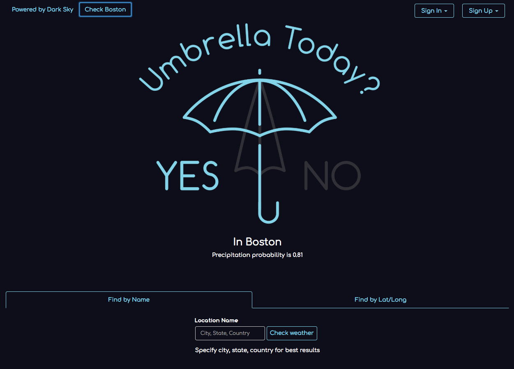

# UmbrellaToday
- Deployed front-end: https://tazukopowell.com/umbrellatoday_frontend
- Deployed back-end: https://floating-earth-61602.herokuapp.com
- Back-end repo: https://github.com/tazpowell/umbrellatoday_backend

## Front-end
This repo is the front-end for my UmbrellaToday web app.
It uses weather data from [DarkSky's API](https://darksky.net/dev/docs) to determine if you need to bring an umbrella with you today. Lat/long data for a location is obtained though forward geocoding via https://geocode.xyz/ API.

Unregistered users can look up weather info based on location name or lat/long values.
Registered users can add locations into a saved list if they provide location name, latitude, and longitude values.

## Technologies
JavaScript, jQuery, AJAX, Handlebars, Bootstrap, HTML/CSS

## Development Process
#### Planning
I was excited to incorporate a third-party API into my final project app. After doing research on available weather APIs, I picked the DarkSky API because their data includes precipitation probability. Since their API requires a request with lat/long values, I also looked into geocoding resources and found geocode.xyz.

Next, I planned the functionality and basic layout, using the ERD and user stories as a basis. I created both front and back end repos and started building my resources in Rails.

#### Problem Solving
My biggest unknown was working with the DarkSky API. I used the HTTParty gem to make the GET requests from my backend. After reviewing docs, other example code using HTTParty and/or DarkSky API, I was able to successfully retrieve weather data based on any valid lat/long values.

Then I created CURL scripts to test all the resources (users, locations, coordinates, forecasts) and moved on to build the front end that would interact with the back end.

After the front and back end interacted with each other successfully, I focused on the UI.

#### Future Iterations
Additional features would be to update the Add New Locations form so users can look up locations by name, similar to the Find By Name form above it. On the front end, I also removed the 'default' field on a user's locations -- but I would like to build the functionality for user's to select one default location that would load when they sign in.

I'm also interested in exploring HTMLCanvas to possibilty add some animated rain drops when the answer is yes.

## Set up on localhost
- Fork and clone
- Install dependencies with `npm install`
- `grunt <server|serve|s>`: generates bundles, watches, and livereloads

## Wireframe and user stories
[Wireframe](https://drive.google.com/file/d/1F38nbApVS5fTnz7JVl_s25IVaDhRoody/view?usp=sharing)

V1
### As an unregisterd user, I want to:
- sign up with email and password
- be told when my passwords do not match
- after a successful sign up, be automatically signed in
- see the Yes/No answer for the app's default location (Boston, MA)
- see the Yes/No asnwer by searching for a location by name
- see the Yes/No asnwer by searching for a location by lat/long

### As a registerd user, I want to:
- sign in with my email and password
- be shown an error message if my sign in unsuccessful

### After a successful sign-in, I want to:
Locations
- see my saved locations
- add a new location by name, lat/long
- edit a location to make it my default
- delete a location

Change password:
- change my password to a new password
- be shown an error if my old password is same as new password
- be shown an error message when change password is unsuccessful

Sign-out:
- sign out when I finish my session
- be shown an error message when sign out is unsuccessful
